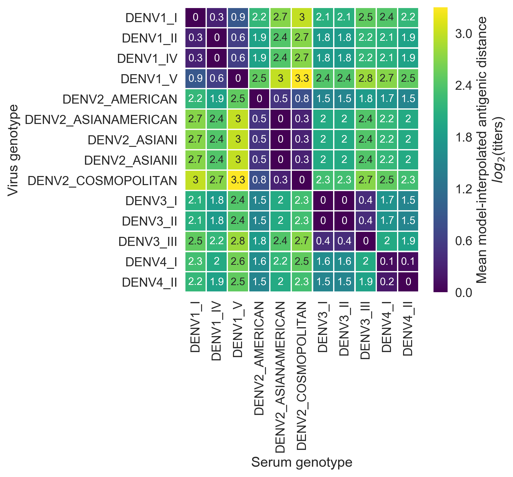

# Dengue antigenic relationships predict evolutionary dynamics

Sidney M. Bell<sup>1,2</sup>, Leah Katzelnick<sup>3,4</sup>, Trevor Bedford<sup>1</sup>

<sup>1</sup>Vaccine and Infectious Disease Division, Fred Hutchinson Cancer Research Center, Seattle, WA, USA, <sup>2</sup>Molecular and Cell Biology Program, University of Washington, Seattle, WA, USA, <sup>3</sup>Division of Infectious Diseases and Vaccinology, School of Public Health, University of California, Berkeley, Berkeley, CA, USA, <sup>4</sup>Department of Biology, University of Florida, Gainesville, FL, USA

## Abstract



Dengue virus (DENV) exists as four genetically distinct serotypes, each of which is also antigenically distinct: the immune response to primary infection can be either cross-protective or associated with severe disease upon heterotypic secondary infection.
Each serotype is historically assumed to be antigenically uniform.
Recent analyses suggest that antigenic heterogeneity may exist within each serotype, but its source, extent and impact remain unclear.
Here, we construct a substitution-based model to directly map antigenic change to underlying genetic divergence.
We identify 49 specific mutations and four colinear mutation clusters that contribute to dengue antigenic variation.
We report moderate antigenic diversity within each serotype, resulting in genotype-specific heterotypic cross-neutralization.
We also quantify the impact of this antigenic heterogeneity on real-world DENV population dynamics.
We find that antigenic fitness mediates fluctuations in DENV clade frequencies, although this appears to be driven by coarser serotype-level antigenic differences.
These results provide a more nuanced understanding of dengue antigenic evolution, with important ramifications for vaccine design and epidemic preparedness.

## Install

Everything is Python 2.7 based. Python packages that are required can be installed via:

```
cd dengue-antigenic-dynamics/
pip install -r requirements
```

## Analysis outline

1. [Run the titer model via augur](titer_model/) (repackaged portion of the [Nextstrain](www.nextstrain.org/dengue) pipeline) to build a viral phylogeny, assign antigenic change to specific mutations, and infer clade frequencies.
2. [Run the fitness model](fitness_model/) to quantify population immunity over time, predict clade frequencies, and assess performance.
3. [Use the visualization notebooks](figures/) to explore results and recreate all the figures from the paper.

## Citation

[Bell SM, Katzelnick L, Bedford T. 2018. Dengue antigenic relationships predict evolutionary dynamics. bioRxiv: 432054.](https://doi.org/10.1101/432054)
